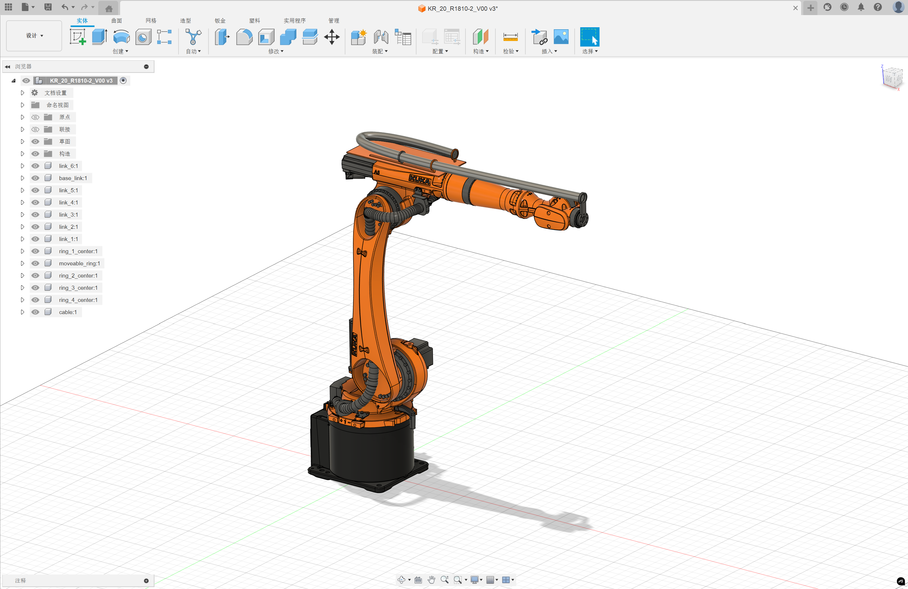

# mujoco 机械臂线缆仿真

## 0. 前言

本文将以 igus 提供的工业机械臂管线包方案为例，创建基于 Mujoco 的机械臂带线缆运动仿真方案

<video width="100%" controls>
  <source src="media/igus_triflex.mp4" type="video/mp4">
</video>

最终的仿真效果如下所示：

<video width="100%" controls>
  <source src="media/kuka_igus_sim.mp4" type="video/mp4">
</video>

完整示例请参考 [Github/Mujoco_tutorial](https://github.com/Alexbeast-CN/Mujoco_tutorial/blob/main/examples/kr20_cable_example.py)

## 1. 关节驱动器

对于机械臂来说，Mujoco 建模时的常见关节驱动类型有：`general`，`motor`，`position`。

对于非常熟悉 Mujoco 的开发者来说，比如 Mujoco 官方的开发者，他们通常会使用 `general` 来控制关节。比如 mujoco menagerie 中的 [kuka_iiwa_14](https://github.com/google-deepmind/mujoco_menagerie/blob/main/kuka_iiwa_14/iiwa14.xml) 的关节驱动类型就是 `general`。它的好处是你可以使用最底层的 api 来定制关节的动力学性能。以尽可能真实的模拟机械臂的物理特性。

然而，如果你对于 Mujoco 没有那么熟悉，但又希望以力矩作为输入量控制关节，那么我推荐你使用使用 `motor` 来控制关节。它简化了关节执行器的参数配置，让你用默认参数就可以实现机械臂的力控效果。

最后是位置式执行器 `position` 。这是实体机械臂中最常用的控制方式。在 Mujoco 中，我们一般也只需要调整关节的 `ctrlrange` 和 pid 的参数。但，即使是使用了 `position` 来控制关节，Mujoco 的关节控制本质上还是基于动力学仿真的。所以，如果我们机械臂末端负载过大，或者你让机械臂以非常大的速度/加速度运动（即增大惯性力矩），那么位置控制就会失效。

<video width="100%" controls>
  <source src="media/dynamic_illustration.mp4" type="video/mp4">
</video>

当机械臂附带线缆运动的时候，线缆会将整个机器人组成一个并联结构，增加仿真中动力学运算的复杂性，导致参数非常难调，且非常容易仿真的失效。所以在机器人进行线缆仿真的时候我不推荐使用 `actuator` ，而是使用完全不考虑动力学的关节位置式控制，因此我们需要删除模型中所有的 `actuator` tag，直接通过 `data.qpos`， `data.qvel`, `data.qacc` 来改变机械臂关节的位置。虽然这个方法 Mujoco 官方不推荐，但是它非常接近目前工业界中非力控机械臂运动规划的思路。

我们以 mujoco menagerie 中的 [ur10e](https://github.com/google-deepmind/mujoco_menagerie/blob/main/universal_robots_ur10e/ur10e.xml) 机器人为例，首先我们将 `<actuator>` 标签中的内容全部删除。然后使用 Jerk 层无突变的时间最优运动规划器 [ruckig](https://ruckig.com/) 生成关节位置，然后在每一个仿真步进之前，直接写入 ruckig 计算出的关节位置。

> 拓展阅读：
> 1. [Ruckig arxiv 论文](https://arxiv.org/abs/2105.04830)
> 2. [Ruckig 知乎博客](https://zhuanlan.zhihu.com/p/710371716)

下面是该方法的最小化示例代码。

```python
import mujoco
import mujoco.viewer
from pynput import keyboard
import numpy as np
from ruckig import InputParameter, OutputParameter, Result, Ruckig

# 初始化 Ruckig 运动规划器
inp = InputParameter(6)
out = OutputParameter(6)

# 运动学参数配置
inp.max_velocity = [1.5] * 6
inp.max_acceleration = [3.0] * 6
inp.max_jerk = [4.0] * 6

# 初始化位置和目标
inp.current_position = [0.0] * 6
inp.current_velocity = [0.0] * 6
inp.current_acceleration = [0.0] * 6
inp.target_position = [0.0] * 6
inp.target_velocity = [0.0] * 6
inp.target_acceleration = [0.0] * 6

# 初始化 MuJoCo 环境
model = mujoco.MjModel.from_xml_path("model/universal_robots_ur10e/ur10e.xml")
data = mujoco.MjData(model)
mujoco.mj_forward(model, data)

# 获取关节信息
joint_names = ["shoulder_pan_joint", "shoulder_lift_joint", "elbow_joint", 
               "wrist_1_joint", "wrist_2_joint", "wrist_3_joint"]
joint_ranges = []
joint_qpos_ids = []
joint_qvel_ids = []

for name in joint_names:
    joint_id = mujoco.mj_name2id(model, mujoco.mjtObj.mjOBJ_JOINT, name)
    joint_ranges.append(model.jnt_range[joint_id])
    joint_qpos_ids.append(model.jnt_qposadr[joint_id])
    joint_qvel_ids.append(model.jnt_dofadr[joint_id])

# 运动控制相关变量
otg = Ruckig(6, model.opt.timestep)
reach_target = False
ruckig_result = Result.Finished

def update_current_position():
    """更新当前关节位置"""
    for i in range(6):
        inp.current_position[i] = data.qpos[joint_qpos_ids[i]]

def generate_random_target():
    """生成随机目标位置"""
    pos = [np.random.uniform(joint_ranges[i][0], joint_ranges[i][1]) for i in range(6)]
    inp.target_position = pos
    print(f"目标位置: {pos}")

def on_key_press(key):
    """键盘控制回调函数"""
    global reach_target
    try:
        if reach_target and key == keyboard.Key.space:
            update_current_position()
            generate_random_target()
    except AttributeError:
        pass

# 启动键盘监听
listener = keyboard.Listener(on_press=on_key_press)
listener.start()

# 主循环
with mujoco.viewer.launch_passive(model, data) as viewer:
    while viewer.is_running():
        # 更新运动状态
        if inp.current_position != inp.target_position:
            reach_target = False
            ruckig_result = Result.Working
            
        if ruckig_result == Result.Working:
            ruckig_result = otg.update(inp, out)
            out.pass_to_input(inp)
        
        if ruckig_result == Result.Finished:
            reach_target = True
        
        # 更新关节位置
        for i in range(6):
            data.qpos[joint_qpos_ids[i]] = out.new_position[i]
            data.qvel[joint_qvel_ids[i]] = 0
            data.qacc[joint_qvel_ids[i]] = 0
            
        mujoco.mj_step(model, data)
        viewer.sync()

listener.stop()
```

<video width="100%" controls>
  <source src="media/positional_control.mp4" type="video/mp4">
</video>

## 2. 添加线缆

通过来说，在进行 Mujoco 仿真之前，我们需要先在类似 Fusion 的 CAD 设计软件中绘制好线缆的初始状态。如下图所示，图中的管线直接使用三维贝塞尔曲线，为了获得更好的可视化效果.（我在曲线上添加了 pipeline 的实体，以表示线缆。）



之后，我们需要将管线的贝塞尔曲线离散化，例如按照 0.01 的步长，将曲线切割成一系列的点。这个过程我们可以使用 `Fusion` 的插件功能，编写 python 脚本实现，比如：

```py
import adsk.core, adsk.fusion, adsk.cam, traceback
import csv
import os

def run(context):
    try:
        # 获取应用程序和用户界面
        app = adsk.core.Application.get()
        ui = app.userInterface
        
        # 选择目标曲线
        # ui.messageBox('请在视图中选择你的管道曲线。')
        sel = ui.selectEntity('选择曲线', 'SketchCurves,Edges')
        if not sel:
            return
        curve = sel.entity
        
        # 获取曲线所在草图平面
        sketch = curve.parentSketch
        
        # 获取草图平面相对于全局坐标系的变换矩阵
        transform = sketch.transform
        
        # 获取曲线长度
        evaluator = curve.geometry.evaluator
        success, curveLength = evaluator.getLengthAtParameter(0.0, 1.0)
        if not success:
            ui.messageBox('无法获取曲线长度，操作取消。')
            return
        # 设置散点间距（厘米）
        spacing = 3.0
        # 计算点的数量
        num_points = int(curveLength / spacing) + 1
        param_step = 1.0 / (num_points - 1)
        
        # 计算等距点并转换为全局坐标
        points = []
        for i in range(num_points):
            param = param_step * i
            success, point = evaluator.getPointAtParameter(param)
            if success:
                # 将点坐标乘以变换矩阵，得到全局坐标
                success = point.transformBy(transform)  # 将转换结果赋给新的对象
                points.append(point)
        
        # 创建文件对话框
        fileDialog = ui.createFileDialog()
        fileDialog.isMultiSelectEnabled = False
        fileDialog.title = "指定保存位置"
        fileDialog.filter = 'CSV 文件 (*.csv)'
        fileDialog.filterIndex = 0
        dialogResult = fileDialog.showSave()
        
        # 设置缩放比例
        scale = 0.01
        if dialogResult == adsk.core.DialogResults.DialogOK:
            filepath = fileDialog.filename
            
            # 写入CSV文件，指定UTF-8编码
            with open(filepath, 'w', newline='', encoding='utf-8') as f:
                writer = csv.writer(f, delimiter=' ')  # 设置分隔符为空格
                writer.writerow(['X', 'Y', 'Z'])  # 写入表头
                for i, point in enumerate(points):
                    writer.writerow([point.x*scale, point.y*scale, point.z*scale])
            
            ui.messageBox(f'已成功将 {len(points)} 个点保存到文件：\n{filepath}')
    
    except:
        if ui:
            ui.messageBox('失败:\n{}'.format(traceback.format_exc()))
```

然后再将这些点作为 `cable` 的 `vertex` 特征。以 `composite` 的方式创建出 `cable`。在创建 cable 的时候需要注意，cable 与 robot 之间应该是相互独立的，即最好直接把 `cable` 创建在 `worldbody` 下。设置 `initial="free"`。之后机器人与线缆之间使用 `equality/weld` 的方式将线缆两端的 `body` 与机器人上对应的 `body` 进行焊接约束。

具体建模方式可以参考 [kuka_kr20.xml](https://github.com/Alexbeast-CN/Mujoco_tutorial/blob/main/model/kuka_kr20/kuka_kr20.xml)